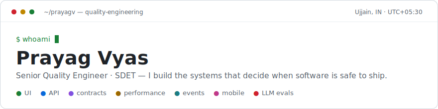
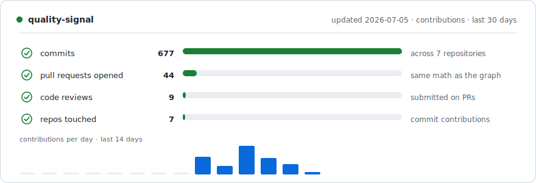

<!-- Profile README for github.com/prayagv — lives in the prayagv/prayagv repo.
     Design language: one continuous terminal session. Every section header is a
     shell command; the content below each is the "output".
     The quality-signal cards are regenerated daily by .github/workflows/quality-signal.yml. -->

<picture>
  <source media="(prefers-color-scheme: dark)" srcset="assets/hero-dark.svg">
  
</picture>

<p align="center">
  <a href="https://www.linkedin.com/in/prayag-vyas"></a>
  <a href="mailto:prayagv2016@gmail.com"></a>
  
  <a href="https://github.com/qa-test-automation-frameworks"></a>
</p>

**Quality is an engineering discipline. I build it like one.**

Seven-plus years as a quality engineer across AdTech, secure enterprise collaboration, and workplace platforms — on systems ranging from legacy monoliths to event-driven microservices. I design and own test automation architecture: the frameworks, contracts, pipelines, and conventions that let teams ship quickly *because* of their tests, not in spite of them. I work from Ujjain, Madhya Pradesh — a city that has stayed continuously alive for a couple of thousand years, which keeps my definition of "legacy system" humble.

## `$ cat ~/about.yml`

```yaml
# the parts a test report can't capture
name: Prayag Vyas
base: Ujjain, Madhya Pradesh, India      # UTC+05:30
hometown_uptime: ~2000 years and counting # older than any codebase I've modernized

off_hours:
  chess:       opening prep, middlegame chaos, endgame discipline — a release cycle in 64 squares
  video_games: field research into how other teams ship (and patch) software
  books:       history and engineering, plus whatever the last bookshop insisted on
  travel:      collecting timezones, not souvenirs
  geopolitics: distributed systems where every node claims sovereignty

warranty: none — but expect strong opinions about flaky tests
```

## `$ ls ~/frameworks --evidence`

Five frameworks, five disciplines. Each is a complete, reviewable system with CI gates, live reports, and a documented reviewer path — I'd rather show evidence than adjectives.

| Framework | Discipline | What it demonstrates | Evidence |
|---|---|---|---|
| [verity-policy-coverage-eval-framework](https://github.com/qa-test-automation-frameworks/verity-policy-coverage-eval-framework) | LLM evaluation | Multi-tier evals for a RAG + tool-use assistant: hermetic PR gate, semantic evals, adversarial red-team, judge calibration, mutation testing | [Reviewer guide](https://github.com/qa-test-automation-frameworks/verity-policy-coverage-eval-framework/blob/main/docs/reviewer-guide.md) |
| [playwright-typescript-framework](https://github.com/qa-test-automation-frameworks/playwright-typescript-framework) | Web UI + API | Strict TypeScript, typed API clients, Zod contracts, visual baselines, Axe accessibility checks, sharded CI | [Live Allure report](https://qa-test-automation-frameworks.github.io/playwright-typescript-framework/) |
| [k6-performance-framework](https://github.com/qa-test-automation-frameworks/k6-performance-framework) | Performance | Typed k6 workloads, SLO-based gates, reviewed regression baselines, Grafana/InfluxDB observability | [Live perf reports](https://qa-test-automation-frameworks.github.io/k6-performance-framework/) |
| [aria-api-framework](https://github.com/qa-test-automation-frameworks/aria-api-framework) | API + contracts | Java 21, layered services, Pact consumer/provider contracts, JSON-schema assertions, OpenAPI endpoint coverage | [CI runs](https://github.com/qa-test-automation-frameworks/aria-api-framework/actions) |
| [selenium-testng-java-framework](https://github.com/qa-test-automation-frameworks/selenium-testng-java-framework) | JVM UI | Selenium 4 + TestNG, Docker Grid, typed configuration, redaction-aware Allure diagnostics, multi-browser CI | [Live Allure report](https://qa-test-automation-frameworks.github.io/selenium-testng-java-framework/) |

## `$ ./quality-signal --refresh`

<picture>
  <source media="(prefers-color-scheme: dark)" srcset="assets/quality-signal-dark.svg">
  
</picture>

This card is not a third-party stats widget. It reads the same GraphQL contributions API that draws the green graph below, and it is rendered by [a small Python generator](scripts/generate_quality_signal.py) with [its own unit tests](scripts/test_generate_quality_signal.py), run daily by [a GitHub Action](.github/workflows/quality-signal.yml) that refuses to publish if the tests fail. A profile README is still software.

## `$ cat /etc/principles.d/quality`

- **Automation is software.** Frameworks get architecture, code review, refactoring, and deprecation plans — treat them as scripts and they rot.
- **Test at the lowest layer that proves the behavior.** UI checks are the last resort, not the default; most business logic wants a service-level answer.
- **Optimize confidence per CI minute, not coverage percentage.** Every test must earn its execution cost.
- **A failing test should explain itself.** Diagnostics, redaction-aware logging, and readable reports are features, not afterthoughts.

## `$ git log --since=2018 --oneline | summarize -n 5`

- Introduced Pact consumer/provider contract testing into a shared automation framework — consumer generation, provider verification, CI integration, contract versioning.
- Built reusable event-driven testing support: producers, consumers, Event Hub workflows, asynchronous assertions.
- Owned and modernized several framework generations: Java · Selenium · TestNG, Selenide · Spring Boot, Python · PyTest, Appium · Experitest.
- Shipped internal productivity tooling: a UUID ↔ legacy-endian converter for MongoDB validation, a standalone ~200-request API regression tool, automated test-data cleanup, a Microsoft Graph auth provider.
- Wired automation into Jenkins, Azure DevOps, Codefresh, and GitHub Actions — parallel execution, faster feedback, diagnostics-first debugging.

## `$ env | grep -i stack`

| Area | Tools |
|---|---|
| **Languages** | Java 21 · TypeScript · Python |
| **UI automation** | Playwright · Selenium · Selenide · TestNG · component-oriented page models |
| **API & contracts** | REST-Assured · Pact · WireMock · OpenAPI · Zod · JSON Schema |
| **Performance** | k6 · Grafana · InfluxDB · SLO-based gates |
| **Events & async** | Event Hub validation · producer/consumer testing |
| **Mobile** | Appium · Experitest STA |
| **LLM quality** | Multi-tier evals · judge calibration · adversarial testing · mutation testing |
| **CI/CD** | GitHub Actions · Jenkins · Azure DevOps · Codefresh |
| **AI-assisted engineering** | GitHub Copilot · Claude · ChatGPT · Atlassian Rovo — accelerators, not autopilots |

## `$ echo $NEXT`

Senior IC roles where framework architecture meets technical leadership: **Staff SDET · Lead SDET · QA Architect · Automation Architect**. Currently deepening distributed systems, Kubernetes, observability, and resilience testing — and always up for a conversation that starts with test strategy and ends somewhere in geopolitics.

## `$ exit 0`

**Reviewer notes.** If you're evaluating me for a role: start with the [Verity reviewer guide](https://github.com/qa-test-automation-frameworks/verity-policy-coverage-eval-framework/blob/main/docs/reviewer-guide.md) — it offers 10-minute, 30-minute, and deep-review paths. Then open a [live Allure report](https://qa-test-automation-frameworks.github.io/playwright-typescript-framework/) or the [k6 dashboards](https://qa-test-automation-frameworks.github.io/k6-performance-framework/). Everything above links to something you can read, run, or rerun. If you'd rather talk chess openings or supply-chain chokepoints first, that works too — [the inbox is open](mailto:prayagv2016@gmail.com).
